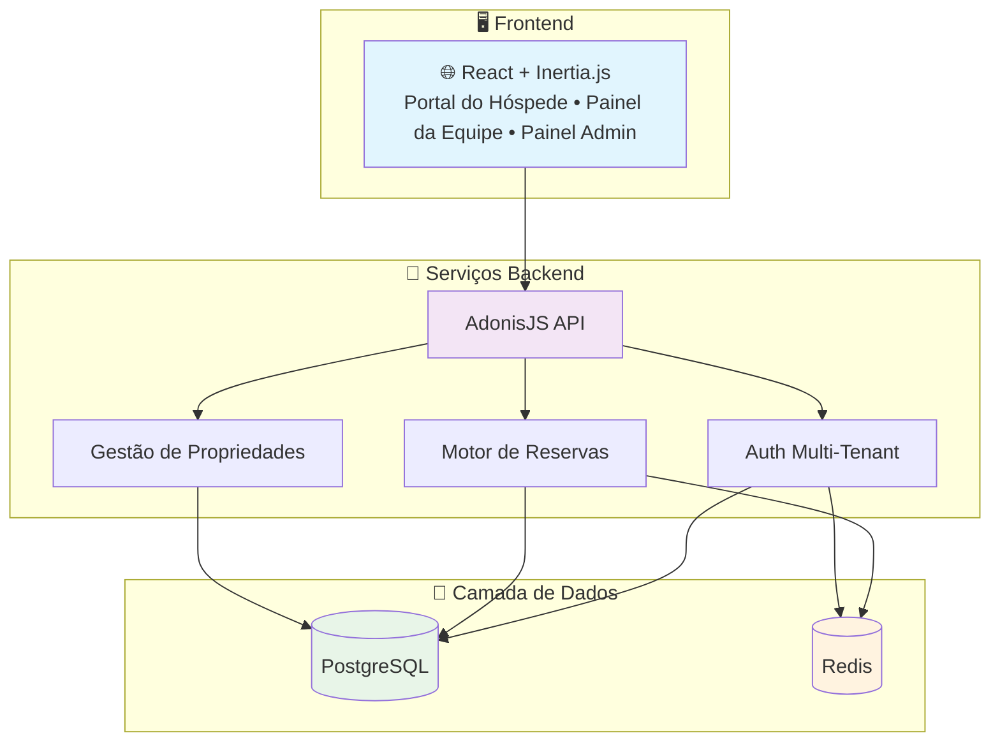
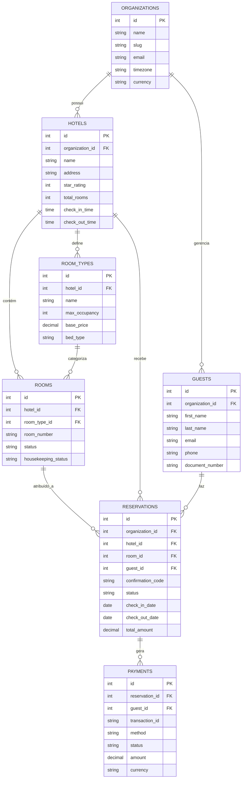

<h1 align="center">
  🏨 Innkeeper
</h1>

<p align="center">
  <strong>Um Sistema Moderno de Gerenciamento Hoteleiro Multi-Tenant</strong>
</p>

<p align="center">
  
  
  
  <a href="https://github.com/gabrielmaialva33/innkeeper/commits/main">
    
  </a>
</p>

<p align="center">
    <a href="README.md">Inglês</a>
    ·
    <a href="README-pt.md">Português</a>
</p>

<p align="center">
  <a href="#bookmark-sobre">Sobre</a>&nbsp;&nbsp;&nbsp;|&nbsp;&nbsp;&nbsp;
  <a href="#sparkles-funcionalidades">Funcionalidades</a>&nbsp;&nbsp;&nbsp;|&nbsp;&nbsp;&nbsp;
  <a href="#rocket-tecnologias">Tecnologias</a>&nbsp;&nbsp;&nbsp;|&nbsp;&nbsp;&nbsp;
  <a href="#hammer_and_wrench-instalação">Instalação</a>&nbsp;&nbsp;&nbsp;|&nbsp;&nbsp;&nbsp;
  <a href="#memo-licença">Licença</a>
</p>

## :bookmark: Sobre

**Innkeeper** é um sistema completo de gerenciamento hoteleiro multi-tenant projetado para otimizar e modernizar as
operações hoteleiras. Construído sobre uma base robusta de backend **AdonisJS v6** e frontend **React 19** com \*
\*Inertia.js\*\*, fornece uma solução completa para gerenciar múltiplas propriedades hoteleiras a partir de uma única
plataforma.

Este sistema atende às necessidades complexas dos negócios de hospitalidade modernos, desde pequenos hotéis boutique até
grandes cadeias hoteleiras. Com sua arquitetura multi-tenant, cada propriedade hoteleira mantém isolamento completo de
dados enquanto se beneficia de infraestrutura compartilhada e recursos de gerenciamento centralizado.

### 🏗️ Visão Geral da Arquitetura



### 🗄️ Esquema do Banco de Dados

Para uma visão detalhada da estrutura do banco de dados, você pode acessar nosso diagrama interativo:

**[📊 Diagrama Interativo do Banco de Dados](https://dbdiagram.io/d/innkeeper-diagram-688adda9cca18e685c90b3f7)**



## :sparkles: Funcionalidades

### Gerenciamento Hoteleiro Principal

- **🏢 Arquitetura Multi-Tenant**: Gerencie múltiplas propriedades hoteleiras com isolamento completo de dados
- **🛏️ Gestão de Quartos**: Inventário completo de quartos, tipos, comodidades e preços
- **📅 Sistema de Reservas**: Motor de reservas avançado com disponibilidade em tempo real
- **👥 Gestão de Hóspedes**: Perfis completos de hóspedes, preferências e histórico
- **💼 Operações de Recepção**: Check-in/out, atribuição de quartos e walk-ins
- **🧹 Governança**: Rastreamento do status dos quartos, cronogramas de limpeza e manutenção
- **💰 Faturamento e Cobrança**: Preços flexíveis, impostos, descontos e processamento de pagamentos

### Funcionalidades Avançadas

- **📊 Painel de Análises**: Métricas de ocupação, receita e desempenho em tempo real
- **🔄 Gerenciador de Canais**: Integração com OTAs (Booking.com, Expedia, etc.)
- **📱 Mobile-Responsive**: Funcionalidade completa em todos os dispositivos
- **🌐 Suporte Multi-Idiomas**: Internacionalização para operações globais
- **👷 Gestão de Equipe**: Papéis, permissões, horários e atribuição de tarefas
- **📧 Central de Comunicação**: E-mails automatizados, notificações SMS e mensagens para hóspedes
- **🎯 Gestão de Receita**: Preços dinâmicos e otimização de rendimento
- **🔗 Integrações de Terceiros**: Sistemas POS, fechaduras de portas e software de contabilidade

### Funcionalidades Técnicas

- **🔐 Controle de Acesso Baseado em Papéis**: Permissões granulares para diferentes tipos de usuários
- **🚀 Atualizações em Tempo Real**: Atualizações ao vivo via WebSocket em toda a plataforma
- **📈 Arquitetura Escalável**: Construída para lidar com propriedades de qualquer tamanho
- **🔒 Segurança de Dados**: Criptografia ponta a ponta e conformidade com padrões hoteleiros
- **🔄 Design API-First**: API RESTful para integrações fáceis
- **📱 Progressive Web App**: Instalável em dispositivos móveis
- **🎨 UI Personalizável**: Sistema de temas para consistência de marca

## :rocket: Tecnologias

### Backend

- **[AdonisJS v6](https://adonisjs.com/)**: Framework Node.js de nível empresarial
- **[PostgreSQL](https://www.postgresql.org/)**: Banco de dados relacional robusto com suporte multi-tenant
- **[Redis](https://redis.io/)**: Cache de alto desempenho e gerenciamento de sessões
- **[Bull Queue](https://github.com/OptimalBits/bull)**: Processamento de jobs em background
- **[JWT](https://jwt.io/)**: Autenticação segura

### Frontend

- **[React 19](https://react.dev/)**: Biblioteca moderna de UI
- **[Inertia.js](https://inertiajs.com/)**: Experiência SPA sem a complexidade
- **[TypeScript](https://www.typescriptlang.org/)**: Desenvolvimento type-safe
- **[Tailwind CSS](https://tailwindcss.com/)**: Estilização utility-first
- **[shadcn/ui](https://ui.shadcn.com/)**: Componentes bonitos e acessíveis
- **[Recharts](https://recharts.org/)**: Visualização de dados

### DevOps & Ferramentas

- **[Docker](https://www.docker.com/)**: Containerização
- **[Vite](https://vitejs.dev/)**: Desenvolvimento ultrarrápido
- **[ESLint](https://eslint.org/)** & **[Prettier](https://prettier.io/)**: Qualidade de código
- **[Japa](https://japa.dev/)**: Framework de testes

## :hammer_and_wrench: Instalação

### Pré-requisitos

- **Node.js** (v18 ou superior)
- **pnpm** (recomendado) ou npm/yarn
- **PostgreSQL** (v14 ou superior)
- **Redis** (v6 ou superior)
- **Docker** (opcional, para configuração containerizada)

### Início Rápido

1. **Clone o repositório:**

   ```bash
   git clone https://github.com/gabrielmaialva33/innkeeper.git
   cd innkeeper
   ```

2. **Instale as dependências:**

   ```bash
   pnpm install
   ```

3. **Configure as variáveis de ambiente:**

   ```bash
   cp .env.example .env
   ```

   Configure seu banco de dados, Redis e outras configurações no arquivo `.env`.

4. **Execute as migrações do banco de dados:**

   ```bash
   node ace migration:run
   ```

5. **Popule dados iniciais (opcional):**

   ```bash
   node ace db:seed
   ```

6. **Inicie o servidor de desenvolvimento:**

   ```bash
   pnpm dev
   ```

   Sua aplicação estará disponível em `http://localhost:3333`

### Configuração com Docker

Para um ambiente containerizado:

```bash
docker-compose up -d
pnpm docker
```

### Deploy em Produção

1. **Compile a aplicação:**

   ```bash
   pnpm build
   ```

2. **Execute as migrações em produção:**

   ```bash
   node ace migration:run --force
   ```

3. **Inicie o servidor de produção:**
   ```bash
   pnpm start
   ```

## :books: Documentação

Para documentação detalhada, visite nossa [Wiki](https://github.com/gabrielmaialva33/innkeeper/wiki) ou verifique a
pasta `/docs`.

### Documentação da API

A documentação da API está disponível em `/api/docs` quando executada em modo de desenvolvimento.

## :handshake: Contribuindo

Contribuições são bem-vindas! Por favor, leia nosso [Guia de Contribuição](CONTRIBUTING.md) para detalhes sobre nosso
código de conduta e o processo para enviar pull requests.

## :memo: Licença

Este projeto está licenciado sob a **Licença MIT**. Veja o arquivo [LICENSE](LICENSE) para mais detalhes.

---

<p align="center">
  Feito com ❤️ para a indústria hoteleira
</p>
