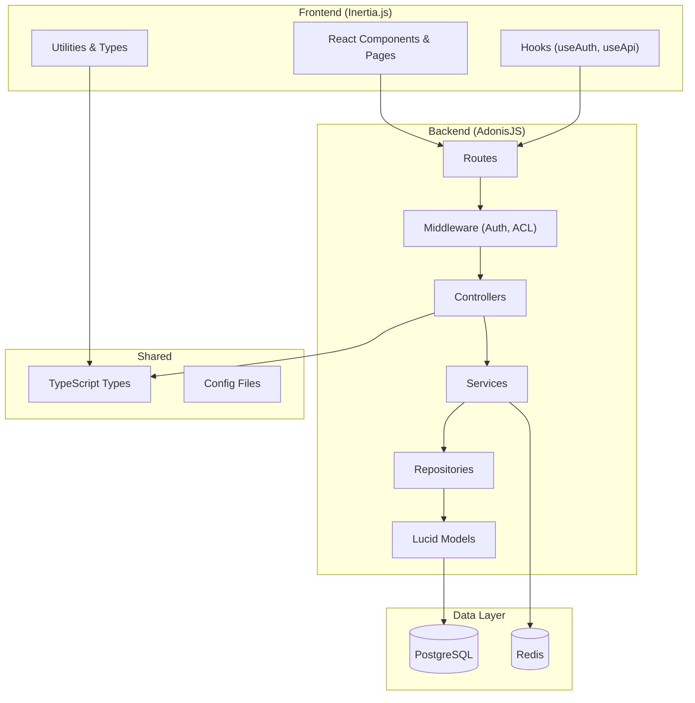

<h1 align="center">
  
</h1>

<p align="center">
  
  
  
  <a href="https://github.com/gabrielmaialva33/adonis-web-kit/commits/main">
    
  </a>
</p>

<p align="center">
    <a href="README.md">English</a>
    ·
    <a href="README-pt.md">Portuguese</a>
</p>

<p align="center">
  <a href="#bookmark-about">About</a>&nbsp;&nbsp;&nbsp;|&nbsp;&nbsp;&nbsp;
  <a href="#rocket-ai-first-development">AI-First Development</a>&nbsp;&nbsp;&nbsp;|&nbsp;&nbsp;&nbsp;
  <a href="#computer-technologies">Technologies</a>&nbsp;&nbsp;&nbsp;|&nbsp;&nbsp;&nbsp;
  <a href="#package-installation">Installation</a>&nbsp;&nbsp;&nbsp;|&nbsp;&nbsp;&nbsp;
  <a href="#memo-license">License</a>
</p>

## :bookmark: About

**Adonis Web Kit** is a modern, opinionated, and AI-first full-stack starter kit designed to accelerate the development of
robust web applications. It combines a powerful **AdonisJS v6** backend with a dynamic **React 19** and **Inertia.js**
frontend, all within a unified monorepo structure.

This project is not just a collection of technologies; it's a foundation engineered for efficiency, scalability, and
seamless collaboration with AI development partners. By providing a well-defined architecture with features like
authentication, role-based access control (RBAC), and file management out of the box, it allows developers (both human
and AI) to focus on building unique business logic instead of boilerplate code.

### 🏗️ Architecture Overview



## :rocket: AI-First Development

This starter kit is uniquely designed to maximize the effectiveness of AI-assisted coding.

- **Unified Context (Monorepo)**: Having backend and frontend code in a single repository provides a complete context
  for AI tools, enabling them to generate more accurate and cohesive code that spans the full stack.
- **Strongly-Typed Foundation**: End-to-end TypeScript usage creates a clear contract between the frontend, backend, and
  API layers. This reduces ambiguity and allows AI to understand data structures and function signatures, leading to
  fewer errors.
- **Modular and Opinionated Architecture**: The clear separation of concerns (controllers, services, repositories) makes
  it easy for an AI to locate, understand, and modify specific parts of the codebase with precision.
- **Focus on Business Logic**: With boilerplate for authentication, permissions, and file storage already handled, AI
  can be directed to solve higher-level business problems from day one.

## 🌟 Key Features

- **🔐 Multi-Guard Authentication**: Ready-to-use JWT-based authentication.
- **👥 Advanced Role-Based Access Control (RBAC)**: Manage user permissions with roles and fine-grained rules.
- **📁 File Management**: Pre-configured file upload service with support for local and S3 drivers.
- **⚡️ Full-Stack Reactivity**: The power of React combined with the simplicity of a traditional server-rendered app,
  thanks to Inertia.js.
- **🎨 UI Components**: A set of beautiful, reusable UI components built with `shadcn/ui`, Tailwind CSS, and
  `lucide-react`.
- **✅ Type-Safe API**: Auto-completion and type checking for API calls and props.
- **🏥 Health Checks**: Integrated health check endpoint for monitoring.

## :computer: Technologies

- **[AdonisJS v6](https://adonisjs.com/)**: A robust Node.js framework for the backend.
- **[React 19](https://react.dev/)**: A powerful library for building user interfaces.
- **[Inertia.js](https://inertiajs.com/)**: The glue that connects the modern frontend with the backend.
- **[TypeScript](https://www.typescriptlang.org/)**: For type safety across the entire stack.
- **[PostgreSQL](https://www.postgresql.org/)**: A reliable and powerful relational database.
- **[Redis](https://redis.io/)**: Used for caching and session management.
- **[Vite](https://vitejs.dev/)**: For a lightning-fast frontend development experience.
- **[Tailwind CSS](https://tailwindcss.com/)**: A utility-first CSS framework for rapid UI development.

## :package: Installation

### ✔️ Prerequisites

- **Node.js** (v18 or higher)
- **pnpm** (or npm/yarn)
- **Docker** (for running PostgreSQL and Redis)

### 🚀 Getting Started

1. **Clone the repository:**

   ```sh
   git clone https://github.com/gabrielmaialva33/adonis-web-kit.git
   cd adonis-web-kit
   ```

2. **Install dependencies:**

   ```sh
   pnpm install
   ```

3. **Setup environment variables:**

   ```sh
   cp .env.example .env
   ```

   _Open the `.env` file and configure your database credentials and other settings._

4. **Run database migrations:**

   ```sh
   node ace migration:run
   ```

5. **Start the development server:**
   ```sh
   pnpm dev
   ```
   _Your application will be available at `http://localhost:3333`._

### 📜 Available Scripts

- `pnpm dev`: Starts the development server with HMR.
- `pnpm build`: Compiles the application for production.
- `pnpm start`: Runs the production-ready server.
- `pnpm test`: Executes unit tests.
- `pnpm test:e2e`: Executes end-to-end tests.
- `pnpm lint`: Lints the codebase.
- `pnpm format`: Formats the code with Prettier.

## :memo: License

This project is licensed under the **MIT License**. See the [LICENSE](LICENSE) file for details.

---

<p align="center">
  Made with ❤️ by the community.
</p>
