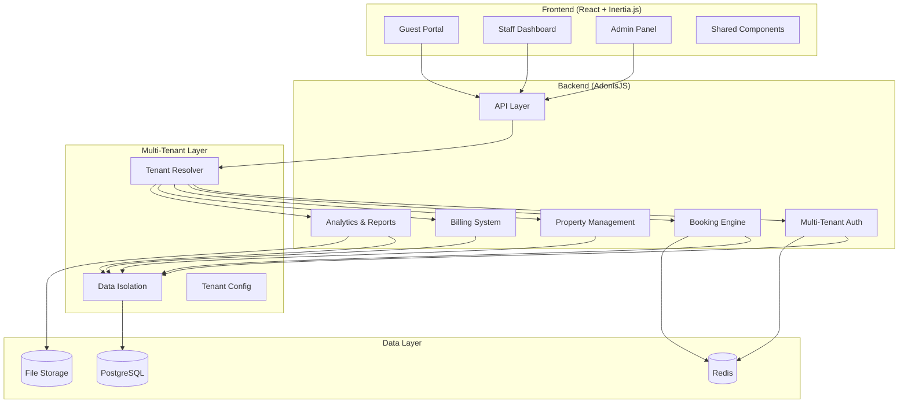

<h1 align="center">
  🏨 Innkeeper
</h1>

<p align="center">
  <strong>A Modern Multi-Tenant Hotel Management System</strong>
</p>

<p align="center">
  
  
  
  <a href="https://github.com/gabrielmaialva33/innkeeper/commits/main">
    
  </a>
</p>

<p align="center">
    <a href="README.md">English</a>
    ·
    <a href="README-pt.md">Portuguese</a>
</p>

<p align="center">
  <a href="#bookmark-about">About</a>&nbsp;&nbsp;&nbsp;|&nbsp;&nbsp;&nbsp;
  <a href="#sparkles-features">Features</a>&nbsp;&nbsp;&nbsp;|&nbsp;&nbsp;&nbsp;
  <a href="#rocket-technologies">Technologies</a>&nbsp;&nbsp;&nbsp;|&nbsp;&nbsp;&nbsp;
  <a href="#hammer_and_wrench-installation">Installation</a>&nbsp;&nbsp;&nbsp;|&nbsp;&nbsp;&nbsp;
  <a href="#memo-license">License</a>
</p>

## :bookmark: About

**Innkeeper** is a comprehensive multi-tenant hotel management system designed to streamline and modernize hotel
operations. Built on a robust foundation of **AdonisJS v6** backend and **React 19** with **Inertia.js** frontend, it
provides a complete solution for managing multiple hotel properties from a single platform.

This system addresses the complex needs of modern hospitality businesses, from small boutique hotels to large hotel
chains. With its multi-tenant architecture, each hotel property maintains complete data isolation while benefiting from
shared infrastructure and centralized management capabilities.

### 🏗️ Architecture Overview



### 🗄️ Database Schema

For a detailed view of the database structure, you can access our interactive database diagram:

**[📊 Interactive Database Diagram](https://dbdiagram.io/d/innkeeper-diagram-688adda9cca18e685c90b3f7)**

```mermaid
---
config:
  layout: elk
---
classDiagram
direction BT
class adonis_schema {
   varchar(255) name
   integer batch
   timestamp with time zone migration_time
   integer id
}
class adonis_schema_versions {
   integer version
}
class amenities {
   varchar(255) name
   varchar(255) code
   text description
   text category
   varchar(255) icon
   boolean is_active
   jsonb metadata
   timestamp with time zone created_at
   timestamp with time zone updated_at
   integer id
}
class audit_logs {
   integer user_id
   varchar(100) session_id
   varchar(45) ip_address
   varchar(500) user_agent
   varchar(100) resource
   varchar(50) action
   varchar(50) context
   integer resource_id
   varchar(10) method
   varchar(500) url
   json request_data
   text result
   varchar(255) reason
   integer response_code
   json metadata
   timestamp with time zone created_at
   timestamp with time zone updated_at
   integer id
}
class auth_access_tokens {
   integer tokenable_id
   varchar(255) type
   varchar(255) name
   varchar(255) hash
   text abilities
   timestamp with time zone created_at
   timestamp with time zone updated_at
   timestamp with time zone last_used_at
   timestamp with time zone expires_at
   integer id
}
class files {
   integer owner_id
   varchar(255) client_name
   varchar(255) file_name
   integer file_size
   varchar(255) file_type
   varchar(255) file_category
   varchar(255) url
   timestamp with time zone created_at
   timestamp with time zone updated_at
   integer id
}
class folios {
   integer organization_id
   integer reservation_id
   integer guest_id
   varchar(255) folio_number
   text status
   numeric(12,2) room_charges
   numeric(12,2) service_charges
   numeric(10,2) tax_amount
   numeric(10,2) discount_amount
   numeric(12,2) total_amount
   numeric(12,2) paid_amount
   numeric(12,2) balance
   varchar(3) currency
   timestamp with time zone opened_at
   timestamp with time zone closed_at
   integer closed_by_user_id
   text notes
   boolean is_deleted
   jsonb metadata
   timestamp with time zone created_at
   timestamp with time zone updated_at
   integer id
}
class guests {
   integer organization_id
   integer user_id
   varchar(255) first_name
   varchar(255) last_name
   varchar(255) email
   varchar(255) phone
   varchar(255) mobile
   text document_type
   varchar(255) document_number
   varchar(255) document_issuer
   date document_expiry_date
   date date_of_birth
   varchar(255) nationality
   text gender
   varchar(255) address
   varchar(255) city
   varchar(255) state
   varchar(255) country
   varchar(255) postal_code
   varchar(255) company_name
   varchar(255) tax_id
   text vip_status
   varchar(255) loyalty_number
   integer loyalty_points
   boolean is_blacklisted
   text blacklist_reason
   boolean is_deleted
   jsonb preferences
   jsonb marketing
   jsonb metadata
   timestamp with time zone last_stay_date
   integer total_stays
   numeric(12,2) total_spent
   timestamp with time zone created_at
   timestamp with time zone updated_at
   integer id
}
class hotel_amenities {
   timestamp with time zone created_at
   timestamp with time zone updated_at
   integer hotel_id
   integer amenity_id
}
class hotels {
   integer organization_id
   varchar(255) name
   varchar(255) slug
   text description
   varchar(255) email
   varchar(255) phone
   varchar(255) website
   varchar(255) address
   varchar(255) city
   varchar(255) state
   varchar(255) country
   varchar(255) postal_code
   numeric(10,8) latitude
   numeric(11,8) longitude
   varchar(255) timezone
   varchar(3) currency
   integer star_rating
   integer total_rooms
   time check_in_time
   time check_out_time
   boolean is_active
   boolean is_deleted
   jsonb policies
   jsonb contact_info
   jsonb metadata
   timestamp with time zone created_at
   timestamp with time zone updated_at
   integer id
}
class organizations {
   varchar(255) name
   varchar(255) slug
   varchar(255) tax_id
   varchar(255) email
   varchar(255) phone
   varchar(255) address
   varchar(255) city
   varchar(255) state
   varchar(255) country
   varchar(255) postal_code
   varchar(3) currency
   varchar(255) timezone
   boolean is_active
   boolean is_deleted
   jsonb settings
   jsonb metadata
   timestamp with time zone created_at
   timestamp with time zone updated_at
   integer id
}
class payments {
   integer organization_id
   integer reservation_id
   integer folio_id
   integer guest_id
   integer processed_by_user_id
   varchar(255) transaction_id
   text type
   text method
   text status
   numeric(12,2) amount
   varchar(3) currency
   numeric(10,6) exchange_rate
   numeric(12,2) base_currency_amount
   varchar(255) gateway
   varchar(255) gateway_transaction_id
   text gateway_response
   varchar(4) card_last_four
   varchar(255) card_brand
   varchar(255) reference_number
   text notes
   varchar(255) receipt_number
   timestamp with time zone paid_at
   timestamp with time zone failed_at
   text failure_reason
   boolean is_deleted
   jsonb metadata
   timestamp with time zone created_at
   timestamp with time zone updated_at
   integer id
}
class permissions {
   varchar(255) name
   varchar(500) description
   varchar(100) resource
   varchar(50) action
   varchar(50) context
   timestamp with time zone created_at
   timestamp with time zone updated_at
   integer id
}
class rate_limits {
   integer points
   bigint expire
   varchar(255) key
}
class reservation_services {
   integer quantity
   numeric(10,2) unit_price
   numeric(12,2) total_price
   timestamp with time zone created_at
   timestamp with time zone updated_at
   integer reservation_id
   integer service_id
}
class reservations {
   integer organization_id
   integer hotel_id
   integer room_id
   integer room_type_id
   integer guest_id
   integer created_by_user_id
   integer group_reservation_id
   varchar(255) confirmation_number
   text status
   text channel
   varchar(255) channel_reference
   timestamp with time zone check_in_date
   timestamp with time zone check_out_date
   timestamp with time zone actual_check_in
   timestamp with time zone actual_check_out
   integer adults
   integer children
   integer infants
   numeric(10,2) room_rate
   numeric(12,2) total_amount
   numeric(12,2) paid_amount
   numeric(10,2) discount_amount
   numeric(10,2) tax_amount
   varchar(3) currency
   text payment_status
   text payment_method
   text special_requests
   time arrival_time
   text purpose_of_visit
   boolean is_vip
   boolean requires_pickup
   varchar(255) pickup_location
   timestamp with time zone pickup_time
   text cancellation_reason
   timestamp with time zone cancelled_at
   integer cancelled_by_user_id
   boolean is_deleted
   jsonb guest_details
   jsonb metadata
   timestamp with time zone created_at
   timestamp with time zone updated_at
   integer id
}
class role_permissions {
   integer role_id
   integer permission_id
   timestamp with time zone created_at
   timestamp with time zone updated_at
   integer id
}
class roles {
   varchar(255) name
   text description
   varchar(255) slug
   timestamp with time zone created_at
   timestamp with time zone updated_at
   integer id
}
class room_type_amenities {
   timestamp with time zone created_at
   timestamp with time zone updated_at
   integer room_type_id
   integer amenity_id
}
class room_types {
   integer organization_id
   integer hotel_id
   varchar(255) name
   varchar(255) code
   text description
   integer max_occupancy
   integer max_adults
   integer max_children
   numeric(10,2) base_price
   numeric(10,2) extra_bed_price
   numeric(8,2) size_sqm
   varchar(255) bed_type
   integer bed_count
   varchar(255) view_type
   boolean is_active
   boolean is_deleted
   jsonb images
   jsonb metadata
   timestamp with time zone created_at
   timestamp with time zone updated_at
   integer id
}
class rooms {
   integer organization_id
   integer hotel_id
   integer room_type_id
   varchar(255) room_number
   varchar(255) floor
   varchar(255) building
   text status
   text housekeeping_status
   boolean is_smoking
   boolean is_accessible
   integer connecting_room_id
   timestamp with time zone last_cleaned_at
   timestamp with time zone last_inspected_at
   boolean is_active
   boolean is_deleted
   jsonb notes
   jsonb metadata
   timestamp with time zone created_at
   timestamp with time zone updated_at
   integer id
}
class services {
   integer organization_id
   integer hotel_id
   varchar(255) name
   varchar(255) code
   text description
   text category
   numeric(10,2) unit_price
   text unit_type
   numeric(5,2) tax_rate
   boolean is_taxable
   boolean is_available_24h
   time available_from
   time available_until
   integer max_quantity_per_day
   boolean requires_advance_booking
   integer advance_booking_hours
   boolean is_active
   boolean is_deleted
   jsonb metadata
   timestamp with time zone created_at
   timestamp with time zone updated_at
   integer id
}
class staff {
   integer organization_id
   integer user_id
   varchar(255) employee_id
   text department
   varchar(255) position
   date hire_date
   date termination_date
   boolean is_active
   boolean is_deleted
   jsonb contact_info
   jsonb metadata
   timestamp with time zone created_at
   timestamp with time zone updated_at
   integer id
}
class staff_hotels {
   boolean is_primary
   timestamp with time zone started_at
   timestamp with time zone ended_at
   timestamp with time zone created_at
   timestamp with time zone updated_at
   integer staff_id
   integer hotel_id
}
class user_permissions {
   integer user_id
   integer permission_id
   boolean granted
   timestamp with time zone expires_at
   timestamp with time zone created_at
   timestamp with time zone updated_at
   integer id
}
class user_roles {
   integer user_id
   integer role_id
   timestamp with time zone created_at
   timestamp with time zone updated_at
   integer id
}
class users {
   varchar(255) full_name
   varchar(254) email
   varchar(80) username
   varchar(255) password
   integer organization_id
   boolean is_deleted
   jsonb metadata
   timestamp with time zone created_at
   timestamp with time zone updated_at
   integer id
}
audit_logs --> users : user_id
auth_access_tokens --> users : tokenable_id
files --> users : owner_id
folios --> guests : guest_id
folios --> organizations : organization_id
folios --> reservations : reservation_id
folios --> users : closed_by_user_id
guests --> organizations : organization_id
guests --> users : user_id
hotel_amenities --> amenities : amenity_id
hotel_amenities --> hotels : hotel_id
hotels --> organizations : organization_id
payments --> folios : folio_id
payments --> guests : guest_id
payments --> organizations : organization_id
payments --> reservations : reservation_id
payments --> users : processed_by_user_id
reservation_services --> reservations : reservation_id
reservation_services --> services : service_id
reservations --> guests : guest_id
reservations --> hotels : hotel_id
reservations --> organizations : organization_id
reservations --> room_types : room_type_id
reservations --> rooms : room_id
reservations --> users : created_by_user_id
reservations --> users : cancelled_by_user_id
role_permissions --> permissions : permission_id
role_permissions --> roles : role_id
room_type_amenities --> amenities : amenity_id
room_type_amenities --> room_types : room_type_id
room_types --> hotels : hotel_id
room_types --> organizations : organization_id
rooms --> hotels : hotel_id
rooms --> organizations : organization_id
rooms --> room_types : room_type_id
rooms --> rooms : connecting_room_id
services --> hotels : hotel_id
services --> organizations : organization_id
staff --> organizations : organization_id
staff --> users : user_id
staff_hotels --> hotels : hotel_id
staff_hotels --> staff : staff_id
user_permissions --> permissions : permission_id
user_permissions --> users : user_id
user_roles --> roles : role_id
user_roles --> users : user_id
users --> organizations : organization_id
```



## :sparkles: Features

### Core Hotel Management

- **🏢 Multi-Tenant Architecture**: Manage multiple hotel properties with complete data isolation
- **🛏️ Room Management**: Comprehensive room inventory, types, amenities, and pricing
- **📅 Reservation System**: Advanced booking engine with real-time availability
- **👥 Guest Management**: Complete guest profiles, preferences, and history
- **💼 Front Desk Operations**: Check-in/out, room assignments, and walk-ins
- **🧹 Housekeeping**: Room status tracking, cleaning schedules, and maintenance
- **💰 Billing & Invoicing**: Flexible pricing, taxes, discounts, and payment processing

### Advanced Features

- **📊 Analytics Dashboard**: Real-time occupancy, revenue, and performance metrics
- **🔄 Channel Manager**: Integration with OTAs (Booking.com, Expedia, etc.)
- **📱 Mobile-Responsive**: Full functionality across all devices
- **🌐 Multi-Language Support**: Internationalization for global operations
- **👷 Staff Management**: Roles, permissions, schedules, and task assignments
- **📧 Communication Hub**: Automated emails, SMS notifications, and guest messaging
- **🎯 Revenue Management**: Dynamic pricing and yield optimization
- **🔗 Third-Party Integrations**: POS systems, door locks, and accounting software

### Technical Features

- **🔐 Role-Based Access Control**: Granular permissions for different user types
- **🚀 Real-Time Updates**: WebSocket-powered live updates across the platform
- **📈 Scalable Architecture**: Built to handle properties of any size
- **🔒 Data Security**: End-to-end encryption and compliance with hospitality standards
- **🔄 API-First Design**: RESTful API for easy integrations
- **📱 Progressive Web App**: Installable on mobile devices
- **🎨 Customizable UI**: Theming system for brand consistency

## :rocket: Technologies

### Backend

- **[AdonisJS v6](https://adonisjs.com/)**: Enterprise-grade Node.js framework
- **[PostgreSQL](https://www.postgresql.org/)**: Robust relational database with multi-tenant support
- **[Redis](https://redis.io/)**: High-performance caching and session management
- **[Bull Queue](https://github.com/OptimalBits/bull)**: Background job processing
- **[JWT](https://jwt.io/)**: Secure authentication

### Frontend

- **[React 19](https://react.dev/)**: Modern UI library
- **[Inertia.js](https://inertiajs.com/)**: SPA experience without the complexity
- **[TypeScript](https://www.typescriptlang.org/)**: Type-safe development
- **[Tailwind CSS](https://tailwindcss.com/)**: Utility-first styling
- **[shadcn/ui](https://ui.shadcn.com/)**: Beautiful, accessible components
- **[Recharts](https://recharts.org/)**: Data visualization

### DevOps & Tools

- **[Docker](https://www.docker.com/)**: Containerization
- **[Vite](https://vitejs.dev/)**: Lightning-fast development
- **[ESLint](https://eslint.org/)** & **[Prettier](https://prettier.io/)**: Code quality
- **[Japa](https://japa.dev/)**: Testing framework

## :hammer_and_wrench: Installation

### Prerequisites

- **Node.js** (v18 or higher)
- **pnpm** (recommended) or npm/yarn
- **PostgreSQL** (v14 or higher)
- **Redis** (v6 or higher)
- **Docker** (optional, for containerized setup)

### Quick Start

1. **Clone the repository:**

   ```bash
   git clone https://github.com/gabrielmaialva33/innkeeper.git
   cd innkeeper
   ```

2. **Install dependencies:**

   ```bash
   pnpm install
   ```

3. **Set up environment variables:**

   ```bash
   cp .env.example .env
   ```

   Configure your database, Redis, and other settings in the `.env` file.

4. **Run database migrations:**

   ```bash
   node ace migration:run
   ```

5. **Seed initial data (optional):**

   ```bash
   node ace db:seed
   ```

6. **Start the development server:**

   ```bash
   pnpm dev
   ```

   Your application will be available at `http://localhost:3333`

### Docker Setup

For a containerized environment:

```bash
docker-compose up -d
pnpm docker
```

### Production Deployment

1. **Build the application:**

   ```bash
   pnpm build
   ```

2. **Run migrations in production:**

   ```bash
   node ace migration:run --force
   ```

3. **Start the production server:**
   ```bash
   pnpm start
   ```

## :books: Documentation

For detailed documentation, visit our [Wiki](https://github.com/gabrielmaialva33/innkeeper/wiki) or check the `/docs`
folder.

### API Documentation

API documentation is available at `/api/docs` when running in development mode.

## :handshake: Contributing

Contributions are welcome! Please read our [Contributing Guide](CONTRIBUTING.md) for details on our code of conduct and
the process for submitting pull requests.

## :memo: License

This project is licensed under the **MIT License**. See the [LICENSE](LICENSE) file for details.

---

<p align="center">
  Built with ❤️ for the hospitality industry
</p>
